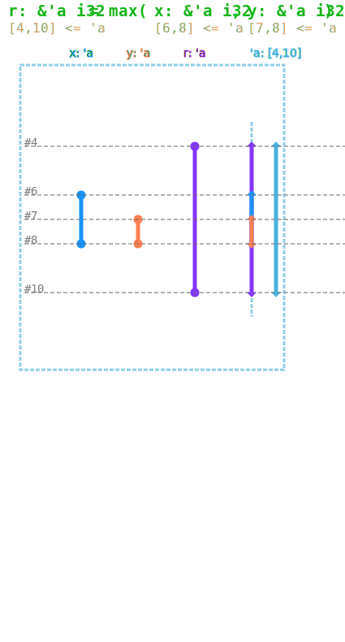

# Lifetime Annotation Manual
## Overview
Rustviz lifetime visualization feature creates interactive SVG on calculation of lifetime parameters in function signatures and struct methods. It consists of basic lifetime analysis from function signautre (under invocation) which generates inequalities for lifetime parameters under contern. Also, a concretizd variables' lifetimes graph will be generated which directly relates to their associated lifetime parameters. If multiple lifetime parameters is present in one function/method, it will group calculation for the same lifetime parameter and render visualization for all lifetime parameter in a unified way. For example, the following functions/methods can be visualized:
+ Lifetime parameters in function call:
```rust
fn max<'a,'b,'r> (lhs: &'a i32, rhs: &'b i32) -> &'r {...}
```
+ Lifetime parameters in struct static method:
```rust
struct Circle<'i>{
    r: &'i i32,
}

impl<'i> Circle<'i>{
    fn new(_r: &'i i32) -> Circle {...}
}

```
+ Lifetime parameters in struct non-static method:
```rust
struct Circle<'i>{
    r: &'i i32,
}

impl<'i> Circle<'i>{
    fn cmp(&'i self, other: &'i i32) -> &'i i32{...}
}
```
Resulting visualization may look like the followings:
+ Example of lifetime parameter in normal function:

+ Example of lifetime parameter in struct static method:
     
+ Example of lifetime parameter in struct non-static method:


***In order to view interactive version, it's recommended to run `view_examples.sh` in `rustviz_mdbook` directory and view in on `localhost:8000`, where hover messages will be enabled.***

## Framework for Creating New Visualization
In this section, we will steer you through creating a new visualization for lifetime parameter in a non-static method for struct `Circle`. First, we need to create a directory to hold all files, called `lifetime_circle`.
Directory framework is basically the same former Rustviz requirements.
```shell
lifetime_circle
├── input
│   └── annotated_source.rs
├── main.rs
├── source.rs
```
Let's explain what roles they play in generating a lifetime visualization.
 ### `lifetime_circle/source.rs`
 This is where your original code will go to. Make sure it contains one and only one `main` function and it should be as simple as possible, namely, no including of custom defined modules. Also, you, as a tutorial maker, should provide correct code. Since Rustviz is not a Rust compiler, it obeys what's dictated from you and generate visualization by annotations you make. Either incorrect code or incorrect annotation results in fallacious visualization. In our case, we define a simple struct to illustrate how lifetime parameter works in struct member method and invoke it in function `main`, which all go into `source.rs`:
```rust
// in source.rs
struct Circle<'i>{
    r: &'i i32,
}

1 fn main(){
2    let r1 = 10;
3    let r2 = 9;
4    let c = Circle::new(&r1);
5    let opt = c.cmp(&r2);
6    println!("{} is larger", opt);
7 }

impl<'i> Circle<'i>{
    fn new(_r: &'i i32) -> Circle {
        Circle{r: _r}
    }
}

impl<'i> Circle<'i>{
    fn cmp(&'i self, other: &'i i32) -> &'i i32{
        if self.r > other{
            self.r
        }
        else{
            other
        }
    }
}
```
 ### `lifetime_circle/main.rs`:
 `main.rs` is the major file for you to provide proper annotations for Rustviz to generate SVG. To note, there can be  lifetime visualization for **only one** function call. That's to say, we cannot generate visualization for both `Circle::new` and `Circle::cmp` in one `main.rs`. To do so, you need to create a separate directory and repeat the same structure. In our case, we just want to visualize `Circle::cmp` invoked on line 7.

 Next step is to inform Rustviz what variables it need to take into account, which also inherit legacy Rustviz implementation. At the beginning of `main.rs`, add the header along with variables names:
 ```rust
 /∗ --- BEGIN Variable Definitions ---
LifetimeVars opt; LifetimeVars c; LifetimeVars &r2;
--- END Variable Definitions --- ∗/
 ```
There are several points to note:
1. Unlike former Rustviz variable declaration, lifetime visualization has its own RAP (resource access point). For now there are only two kinds of RAP defined exclusively lifetime visualization:

    + `LifetimeVars`: variables directly appears in function signature one wants to visualize. This may include all input function parameters, function return variables and struct instance if this is not a static struct method.
    + `LifetimeBind`: variables that contribute to calculation of lifetime parameter but do not immediately obvious from function signature. This can be, for example, one takes a `Vec` for function input variable but it contains multiple references which are annotated by the same lifetime parameter. For example,
    ```rust
    fn process_vec<'i>(queue: &'i Vec<&'i u32>) -> &'i u32 {...}
    ```
    One might consider objects contained in `queue` for calculation of `'i`.

In our example, our goal is to calculate lifetime parameter `'i` by invocation on line 5. Therefore, we need to take care of:
+ `opt`: returned variable (reference) by `Circle::cmp`, should be annotated with `LifetimeVars`.
+ `c`: struct instance of `Circle` which calls method `cmp`, should be annotated with `LifetimeVars`.
+ `&r2`: input variable for `Circle::cmp`, should be annotated with `LifetimeVars`. Note that the ampersand shouldn't be elided, since we're passing a reference rather than an owner object.

Apart from declaring RAPs at the beginning of `main.rs`, we also need to tell which exact function call we're targeting. The reason is simple - there may be multiple invocations of the same function but with different passed variables. We specify the exact function call by adding the lifetime annotation immediately after the call, required on the same line:
```rust
1 fn main(){
2    let r1 = 10;
3    let r2 = 9;
4    let c = Circle::new(&r1);
5    let opt = c.cmp(&r2); // !{ Lifetime(<STRUCT: Circle::cmp>[c{11:14}][&r2{12:12}]->[opt{12:13}])}
6    println!("{} is larger", opt);
7 }
```
`!{ Lifetime(<STRUCT: Circle::cmp>[c{11:14}][&r2{12:12}]->[opt{12:13}])}` is our lifetime annotation, which will be covered in the next section.

### Components of lifetime annotation


### `lifetime_circle/input/annotated_source.rs`
